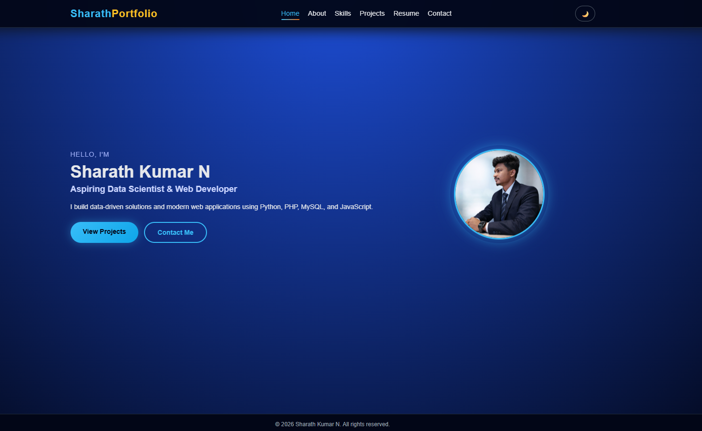
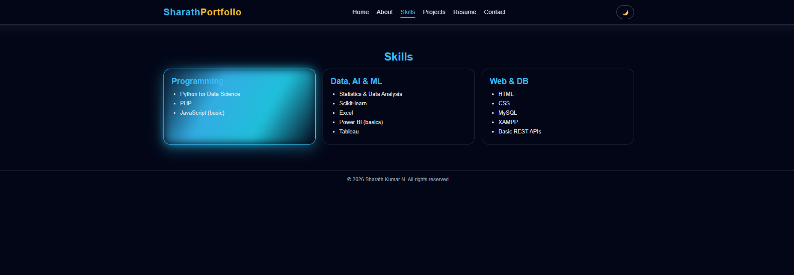
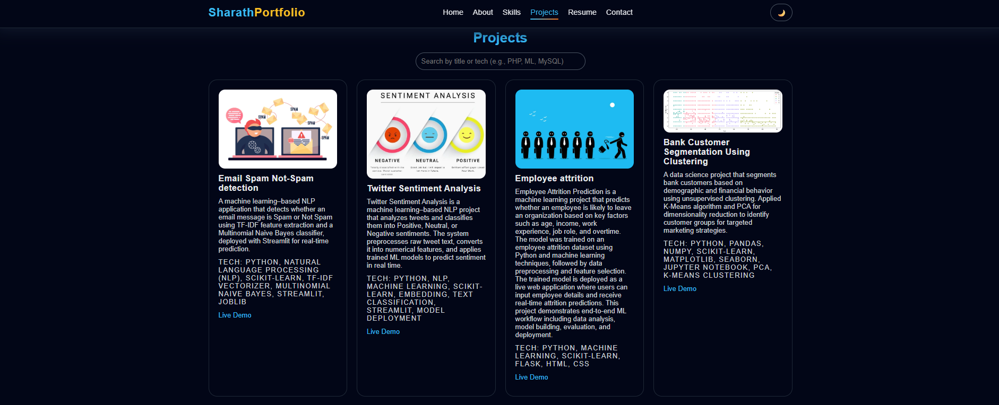

# SHARATH-PORTFOLIO
# 🌐 Personal Portfolio Website

A responsive **personal portfolio website** designed to showcase my profile, skills, projects, and contact information.  
The website includes modern UI features like **dark mode support** and a **resume download option** for better user experience.

---

## ✨ Features

- Personal introduction section
- About Me section
- Skills & technologies overview
- Projects showcase
- Contact form
- Resume download option (PDF)
- Dark mode / Light mode toggle
- Responsive design for all screen sizes
- Clean and modern user interface

---
## 🖼️ Screenshots

### Home Page

### Skills Page (Dark Mode)

### Projects Section

## 🧰 Tech Stack

- HTML  
- CSS  
- JavaScript  
- Bootstrap  
- PHP (for contact form functionality)

---

## ⚙️ How to Run the Project

### Option 1: Run directly
1. Clone or download the repository
2. Open `index.html` in a web browser

### Option 2: Run using Local Server
1. Move the project folder to:
   - `htdocs` (XAMPP) or  
   - `www` (WAMP)
2. Start Apache
3. Open your browser and visit:

## 🚀 Future Enhancements

- Blog section
- Theme customization
- Backend email notifications
- Multi-language support
- Deployment on GitHub Pages / Netlify

---

## 👨‍💻 Author

**Sharath Kumar N**  
GitHub: https://github.com/SharathKumarN8951
LinkedIn: www.linkedin.com/in/sharath-kumar-n-ai

---
